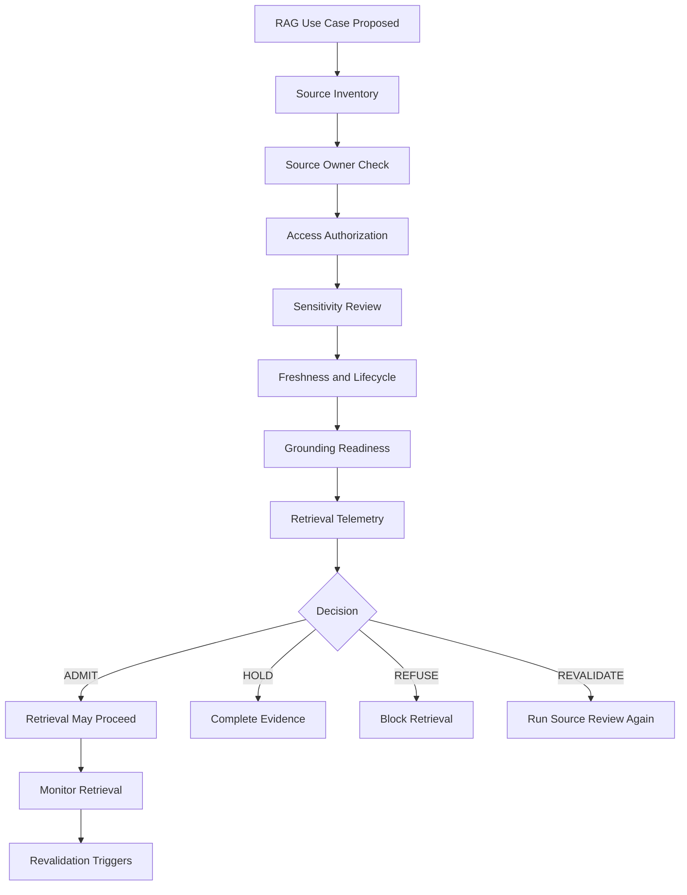

# Architecture Diagram

## RAG Source Authority Flow



---

## Boundary Principle

```text
Retrieval access is not source authority.
```

A RAG system may be technically able to retrieve content while still being unauthorized to use it for enterprise output.
